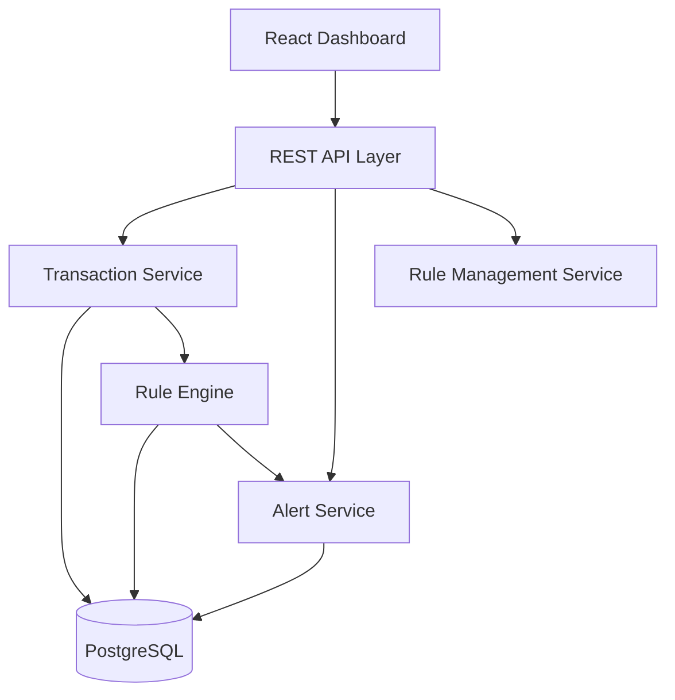
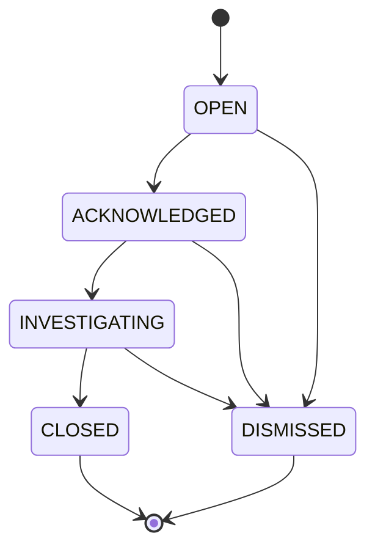
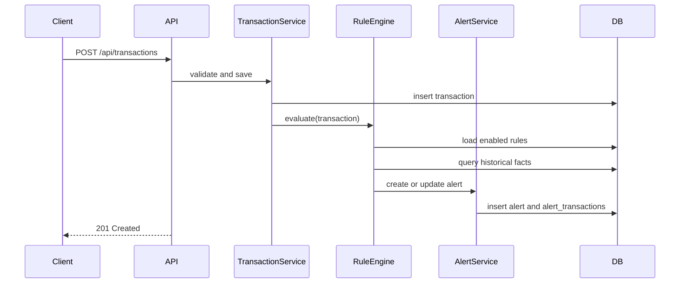

# Transaction Monitoring & Alerts Dashboard 实现方案

## 1. 需求理解与架构取舍

本项目不是单纯的交易 CRUD 系统，核心业务价值在于：交易进入系统后，能够根据规则及时发现风险模式，生成可追踪、可处理、可审计的告警，并让操作员通过前端完成告警处置。

需求文档中有几个关键约束会直接影响设计：

- 无认证、单操作员：第一版不需要用户、角色、权限模型，但所有告警状态变化仍要保留审计记录。审计记录中的 `operator` 可先固定为 `SYSTEM` 或 `default_operator`。
- 交易写入要快：交易录入不应被复杂规则拖慢。MVP 可以同步执行规则，扩展版应通过 Outbox 或消息队列异步评估。
- 规则需要逐步演进：第一版可硬编码，但为了避免后续重构，建议从一开始就把规则定义存入数据库，规则执行逻辑用 Strategy 模式按 `rule_type` 分发。
- 告警生命周期必须严格受控：不能允许任意状态跳转，否则历史统计、平均响应时间、运营流程都会失真。
- 时间逻辑是高风险点：所有数据库时间统一存 UTC，前端只在展示层转换本地时区。

推荐技术栈如下，目的是给开发目标定清楚。如果课堂已指定其他技术，可以保持接口、数据模型和业务流程不变，仅替换框架实现。

- 后端：Spring Boot 3 / Java 21
- 数据库：PostgreSQL
- 前端：React + TypeScript
- API 文档：OpenAPI / Swagger UI
- MVP 处理方式：交易入库后同步评估规则
- 扩展处理方式：Outbox 表 + 后台 worker，未来可替换为 RabbitMQ/Kafka

## 2. 总体架构

系统分为五个边界清晰的模块：



MVP 中，`Transaction Service` 保存交易后直接调用 `Rule Engine`。这样最容易做出可演示版本，也便于测试。等核心流程稳定后，再加入 `transaction_outbox` 表：交易保存和 outbox 事件写入同一个数据库事务，后台 worker 轮询未处理事件并执行规则。这样可以把交易录入延迟和规则评估延迟解耦。

模块职责必须保持单一：

- `Transaction Service`：只负责交易校验、入库、查询，不直接写复杂规则判断。

- `Rule Engine`：加载启用规则，按规则类型执行判断，输出触发结果。

- `Alert Service`：负责告警创建、去重、状态流转、状态历史。

  ```
  Transaction -> MQ -> Rule Engine
  Rule Engine -> Update DB -> send Message to ALert Service
  	        
  ```

- `Rule Management Service`：负责规则 CRUD、启停、参数校验。?

- `Reporting/Query Service`：负责 dashboard 统计查询，避免污染写入服务。

## 3. 核心领域模型

### 3.1 Transaction

交易是规则评估的事实来源。最小字段不宜过多，但必须支持四类规则。

表名：`transactions`

| 字段 | 类型 | 必填 | 说明 |
| --- | --- | --- | --- |
| `id` | UUID | 是 | 系统内部主键 |
| `external_id` | VARCHAR(80) | 是 | 外部交易编号，用于幂等；唯一 |
| `account_id` | VARCHAR(80) | 是 | 出账账户 |
| `payee_id` | VARCHAR(80) | 是 | 收款方/交易对手 |
| `amount` | NUMERIC(18,2) | 是 | 金额，必须大于 0 |
| `currency` | CHAR(3) | 是 | MVP 固定 USD，也保留字段 |
| `type` | VARCHAR(20) | 是 | `DEBIT` / `CREDIT` |
| `status` | VARCHAR(20) | 是 | `PENDING` / `COMPLETED` / `FAILED` |
| `description` | VARCHAR(255) | 否 | 描述 |
| `occurred_at` | TIMESTAMPTZ | 是 | 交易真实发生时间，UTC |
| `created_at` | TIMESTAMPTZ | 是 | 系统接收时间 |

关键索引：

- `uniq_transactions_external_id(external_id)`
- `idx_transactions_account_time(account_id, occurred_at DESC)`
- `idx_transactions_account_payee_time(account_id, payee_id, occurred_at DESC)`
- `idx_transactions_time(occurred_at DESC)`
- `idx_transactions_status_time(status, occurred_at DESC)`

### 3.2 MonitoringRule

规则使用“数据库配置 + 代码策略”的混合方案。数据库保存规则参数，代码负责不同类型的计算逻辑。

表名：`monitoring_rules`

| 字段 | 类型 | 必填 | 说明 |
| --- | --- | --- | --- |
| `id` | UUID | 是 | 主键 |
| `name` | VARCHAR(120) | 是 | 规则名称 |
| `rule_type` | VARCHAR(40) | 是 | `AMOUNT_THRESHOLD` / `VELOCITY` / `NEW_PAYEE` / `DAILY_LIMIT` |
| `severity` | VARCHAR(20) | 是 | `LOW` / `MEDIUM` / `HIGH` |
| `enabled` | BOOLEAN | 是 | 是否启用 |
| `parameters` | JSONB | 是 | 规则参数 |
| `description` | TEXT | 否 | 规则说明 |
| `created_at` | TIMESTAMPTZ | 是 | 创建时间 |
| `updated_at` | TIMESTAMPTZ | 是 | 更新时间 |

规则参数示例：

```json
{
  "thresholdAmount": 10000,
  "currency": "USD"
}
```

```json
{
  "scope": "ACCOUNT",
  "maxTransactions": 5,
  "windowSeconds": 600
}
```

```json
{
  "scope": "ACCOUNT_PAYEE"
}
```

```json
{
  "scope": "ACCOUNT",
  "dailyLimitAmount": 50000,
  "currency": "USD"
}
```

### 3.3 Alert

告警是规则命中的运营对象。一个告警可以**关联一笔或多笔触发交易**。?

表名：`alerts`

| 字段 | 类型 | 必填 | 说明 |
| --- | --- | --- | --- |
| `id` | UUID | 是 | 主键 |
| `rule_id` | UUID | 是 | 触发规则 |
| `rule_name_snapshot` | VARCHAR(120) | 是 | 规则名称快照，避免规则改名影响历史 |
| `rule_type` | VARCHAR(40) | 是 | 规则类型快照 |
| `severity` | VARCHAR(20) | 是 | 严重级别快照 |
| `status` | VARCHAR(20) | 是 | `OPEN` / `ACKNOWLEDGED` / `INVESTIGATING` / `CLOSED` / `DISMISSED` |
| `title` | VARCHAR(160) | 是 | 告警标题 |
| `message` | TEXT | 是 | 告警说明 |
| `scope_key` | VARCHAR(160) | 是 | 去重范围，如 `ACCOUNT:ACC-001` |
| `fingerprint` | VARCHAR(256) | 是 | 去重标识 |
| `triggered_at` | TIMESTAMPTZ | 是 | 触发时间 |
| `acknowledged_at` | TIMESTAMPTZ | 否 | 确认时间 |
| `investigating_at` | TIMESTAMPTZ | 否 | 开始调查时间 |
| `closed_at` | TIMESTAMPTZ | 否 | 关闭时间 |
| `dismissed_at` | TIMESTAMPTZ | 否 | 忽略时间 |
| `resolution_notes` | TEXT | 否 | 关闭或忽略说明 |
| `created_at` | TIMESTAMPTZ | 是 | 创建时间 |
| `updated_at` | TIMESTAMPTZ | 是 | 更新时间 |

关键索引：

- `idx_alerts_status_created(status, created_at DESC)`
- `idx_alerts_severity_created(severity, created_at DESC)`
- `idx_alerts_rule_created(rule_id, created_at DESC)`
- `idx_alerts_fingerprint_status(fingerprint, status)`

### 3.4 AlertTransaction ?  可合并

表名：`alert_transactions`

| 字段 | 类型 | 必填 | 说明 |
| --- | --- | --- | --- |
| `alert_id` | UUID | 是 | 告警 ID |
| `transaction_id` | UUID | 是 | 交易 ID |
| `created_at` | TIMESTAMPTZ | 是 | 关联时间 |

主键：`(alert_id, transaction_id)`

### 3.5 AlertStatusHistory  

表名：`alert_status_history`

| 字段 | 类型 | 必填 | 说明 |
| --- | --- | --- | --- |
| `id` | UUID | 是 | 主键 |
| `alert_id` | UUID | 是 | 告警 ID |
| `from_status` | VARCHAR(20) | 否 | 原状态；创建时为空 |
| `to_status` | VARCHAR(20) | 是 | 新状态 |
| `operator` | VARCHAR(80) | 是 | MVP 固定 `default_operator` |
| `notes` | TEXT | 否 | 操作说明 |
| `created_at` | TIMESTAMPTZ | 是 | 操作时间 |

该表是审计核心，任何状态变化都必须插入记录，不能只更新 `alerts.status`。

## 4. 告警生命周期设计

允许的状态流转如下：



状态校验规则：

- `OPEN` 只能转为 `ACKNOWLEDGED` 或 `DISMISSED`。
- `ACKNOWLEDGED` 只能转为 `INVESTIGATING` 或 `DISMISSED`。
- `INVESTIGATING` 只能转为 `CLOSED` 或 `DISMISSED`。
- `CLOSED` 和 `DISMISSED` 是终态，不允许重新打开。
- `CLOSED` 和 `DISMISSED` 必须填写 `resolution_notes`。
- 每次状态变化都要同时更新 `alerts` 当前状态和插入 `alert_status_history`。

为了避免并发覆盖，更新状态时应带当前状态条件：

```sql
UPDATE alerts
SET status = :toStatus, updated_at = NOW()
WHERE id = :alertId AND status = :expectedFromStatus;
```

如果影响行数为 0，说明告警不存在或状态已变化，API 返回 `409 Conflict`。

## 5. 规则引擎实现细节

### 5.1 规则引擎接口

后端定义统一策略接口：

```java
public interface RuleEvaluator {
    RuleType supports();
    Optional<RuleMatch> evaluate(Transaction tx, MonitoringRule rule, RuleEvaluationContext context);
}
```

`RuleEvaluationContext` 封装数据库查询能力，例如：

- `countTransactions(accountId, fromInclusive, toInclusive)`
- `sumDailyDebitAmount(accountId, date)`
- `existsPreviousPayee(accountId, payeeId, beforeTime)`
- `findTransactionsInWindow(accountId, fromInclusive, toInclusive)`

这样规则类不直接依赖 Repository 的细节，后续可以替换为缓存、物化视图或专门的统计表。

### 5.2 规则执行流程



MVP 可以在同一个请求中返回 `generatedAlertIds`。如果改成异步处理，交易接口只返回交易本身和 `evaluationStatus: PENDING`，前端通过告警列表或实时推送看到结果。

### 5.3 Amount Threshold Rule

触发条件：

- 交易状态为 `COMPLETED`
- 交易类型为 `DEBIT`
- 交易币种匹配规则参数
- `transaction.amount > thresholdAmount`

告警粒度：

- 每笔超限交易生成独立告警。
- `fingerprint = ruleId + ":TX:" + transactionId`。

告警文案示例：

- title：`High value transaction detected`
- message：`Transaction EXT-1001 for account ACC-001 amount 15000.00 USD exceeded threshold 10000.00 USD.`

### 5.4 Velocity Rule

触发条件：

- 交易状态为 `COMPLETED`
- 在 `[transaction.occurred_at - windowSeconds, transaction.occurred_at]` 时间窗口内，同一账户的交易数大于 `maxTransactions`

注意这里是“大于”，文档示例为 “more than 5 transactions”，所以第 6 笔触发。

告警粒度：

- 同一规则、同一账户、同一窗口内应尽量合并，避免第 6、7、8 笔连续生成大量重复告警。
- MVP 可用简单策略：如果存在相同 `rule_id + scope_key` 且状态不是 `CLOSED`/`DISMISSED` 的告警，则只追加 `alert_transactions`，不新建告警。
- `scope_key = ACCOUNT:<accountId>`。
- `fingerprint = ruleId + ":VELOCITY:" + accountId`。

### 5.5 New Payee Rule

触发条件：

- 交易状态为 `COMPLETED`
- 交易类型为 `DEBIT`
- 在该交易发生时间之前，同一账户没有向该 `payee_id` 成功付款的历史

判断 SQL 语义：

```sql
SELECT 1
FROM transactions
WHERE account_id = :accountId
  AND payee_id = :payeeId
  AND status = 'COMPLETED'
  AND type = 'DEBIT'
  AND occurred_at < :currentOccurredAt
LIMIT 1;
```

没有结果则触发。

边界说明：

- 如果系统没有导入历史交易，所有首次出现的 payee 都会被视为新 payee，这是符合当前数据视角的结果。
- 如果两笔同账户同 payee 的交易拥有完全相同 `occurred_at`，应以 `created_at` 或 `id` 做第二排序，避免并发下重复触发。MVP 可以接受低概率重复，扩展版使用唯一约束或锁解决。

### 5.6 Daily Limit Rule

触发条件：

- 交易状态为 `COMPLETED`
- 交易类型为 `DEBIT`
- 同一账户在交易发生日期 UTC 当天的累计出账金额大于 `dailyLimitAmount`

告警粒度：

- 同一规则、同一账户、同一 UTC 日期只保留一个未终结告警。
- `scope_key = ACCOUNT:<accountId>:DATE:<yyyy-MM-dd>`。
- `fingerprint = ruleId + ":DAILY:" + accountId + ":" + utcDate`。

## 6. 告警去重与告警疲劳控制

没有去重时，Velocity 和 Daily Limit 会在高频交易场景下产生大量重复告警，导致操作员忽略系统。

MVP 去重策略：

- Amount Threshold：每笔交易一个告警。
- New Payee：每个账户和 payee 首次交易一个告警。
- Velocity：同一规则、账户存在未终结告警时合并。
- Daily Limit：同一规则、账户、日期存在未终结告警时合并。

合并告警时的行为：

- 不改变已经存在告警的状态。
- 更新 `updated_at`。
- 将新的触发交易插入 `alert_transactions`。
- 可选：在 `message` 中追加最新统计摘要，但不要覆盖原始触发信息。

## 7. REST API 设计

统一响应错误格式：

```json
{
  "error": "VALIDATION_ERROR",
  "message": "amount must be greater than 0",
  "details": [
    {"field": "amount", "reason": "must be positive"}
  ]
}
```

分页参数统一为：

- `page`：从 0 开始
- `size`：默认 20，最大 100
- `sort`：如 `createdAt,desc`

### 7.1 Transactions API

创建交易：

`POST /api/transactions`

请求：

```json
{
  "externalId": "EXT-1001",
  "accountId": "ACC-001",
  "payeeId": "PAYEE-A",
  "amount": 15000.00,
  "currency": "USD",
  "type": "DEBIT",
  "status": "COMPLETED",
  "occurredAt": "2026-07-26T10:30:00Z",
  "description": "Supplier payment"
}
```

响应：

- `201 Created`：新交易创建成功
- `200 OK`：`externalId` 已存在时返回已有交易，实现幂等
- `400 Bad Request`：字段校验失败

响应体：

```json
{
  "id": "uuid",
  "externalId": "EXT-1001",
  "generatedAlertIds": ["uuid"]
}
```

查询交易：

`GET /api/transactions`

过滤条件：

- `accountId`
- `payeeId`
- `status`
- `type`
- `from`
- `to`
- `minAmount`
- `maxAmount`
- `search`
- `hasAlert`

交易详情：

`GET /api/transactions/{id}`

返回交易详情和关联告警摘要。

### 7.2 Alerts API

告警列表：

`GET /api/alerts`

过滤条件：

- `status`
- `severity`
- `ruleType`
- `accountId`
- `from`
- `to`
- `search`

告警详情：

`GET /api/alerts/{id}`

返回：

- 告警基础信息
- 触发规则快照
- 关联交易列表
- 状态历史 timeline

确认告警：

`POST /api/alerts/{id}/acknowledge`

请求：

```json
{
  "notes": "Reviewed by operator"
}
```

开始调查：

`POST /api/alerts/{id}/investigate`

关闭告警：

`POST /api/alerts/{id}/close`

请求：

```json
{
  "resolutionNotes": "Confirmed legitimate high value supplier payment"
}
```

忽略告警：

`POST /api/alerts/{id}/dismiss`

请求：

```json
{
  "resolutionNotes": "False positive caused by approved payroll batch"
}
```

状态流转错误返回：

- `409 Conflict`
- error：`INVALID_ALERT_STATUS_TRANSITION`

### 7.3 Rules API

规则列表：

`GET /api/rules`

支持：

- `enabled`
- `ruleType`
- `severity`

创建规则：

`POST /api/rules`

更新规则：

`PUT /api/rules/{id}`

启用或停用：

`PATCH /api/rules/{id}/enabled`

请求：

```json
{
  "enabled": false
}
```

删除规则：

`DELETE /api/rules/{id}`

建议第一版做软删除或禁用，不做物理删除。因为历史告警需要能追溯规则。

### 7.4 Dashboard API

`GET /api/dashboard/summary`

返回：

```json
{
  "openAlerts": 12,
  "acknowledgedAlerts": 4,
  "investigatingAlerts": 3,
  "alertsToday": 8,
  "transactionsToday": 340,
  "transactionVolumeToday": 785000.00,
  "averageAcknowledgeMinutes": 18.5,
  "averageResolutionMinutes": 240.0
}
```

`GET /api/dashboard/alert-status-counts`

`GET /api/dashboard/alert-severity-counts`

`GET /api/dashboard/transaction-volume?groupBy=hour&from=...&to=...`

## 8. 前端页面设计

前端目标是让操作员快速发现、理解和处理告警。第一版不做复杂视觉效果，重点是表格、过滤器、详情页和明确按钮状态。

### 8.1 Transactions 页面

功能：

- 表格展示交易编号、账户、payee、金额、币种、类型、状态、发生时间、是否触发告警。
- 支持账户、payee、日期范围、金额范围、状态、关键词过滤。
- 点击交易进入详情，显示关联告警。

实现注意：

- 金额右对齐。
- 时间展示本地时区，但请求和响应保持 ISO UTC。
- `hasAlert` 用明显标识，但不要只依赖颜色。

### 8.2 Alerts 页面

功能：

- 顶部摘要：Open、Acknowledged、Investigating、Alerts Today、Average Resolution Time。
- 告警表格：严重级别、状态、规则名称、触发时间、关联交易数。
- 支持状态、严重级别、规则类型、日期范围过滤。
- 点击行进入详情。

默认排序：

- `severity` 高优先
- `createdAt desc`

### 8.3 Alert Detail 页面

必须包含：

- 告警标题、当前状态、严重级别。
- 触发规则、触发原因、scope。
- 关联交易表格。
- 状态历史 timeline。
- 当前状态下允许的操作按钮。

按钮显示规则：

- `OPEN`：显示 `Acknowledge`、`Dismiss`。
- `ACKNOWLEDGED`：显示 `Start Investigation`、`Dismiss`。
- `INVESTIGATING`：显示 `Close`、`Dismiss`。
- `CLOSED` / `DISMISSED`：不显示操作按钮。

### 8.4 Rules 页面

功能：

- 表格展示规则名称、类型、严重级别、启用状态、更新时间。
- 支持启用/停用。
- 支持新增和编辑规则。
- 表单根据 `ruleType` 动态显示参数。

参数校验应在前后端都做：

- `thresholdAmount > 0`
- `maxTransactions >= 1`
- `windowSeconds >= 60`
- `dailyLimitAmount > 0`
- `currency` 必须是 3 位大写字母

## 9. 后端项目结构建议

```text
src/main/java/com/bytebounce/monitoring
  api
    TransactionController.java
    AlertController.java
    RuleController.java
    DashboardController.java
  application
    TransactionService.java
    AlertService.java
    RuleManagementService.java
    DashboardQueryService.java
  domain
    transaction
      Transaction.java
      TransactionStatus.java
      TransactionType.java
    alert
      Alert.java
      AlertStatus.java
      AlertSeverity.java
      AlertStatusHistory.java
    rule
      MonitoringRule.java
      RuleType.java
  ruleengine
    RuleEngine.java
    RuleEvaluator.java
    AmountThresholdEvaluator.java
    VelocityEvaluator.java
    NewPayeeEvaluator.java
    DailyLimitEvaluator.java
    RuleEvaluationContext.java
  persistence
    TransactionRepository.java
    AlertRepository.java
    RuleRepository.java
  config
  common
    ApiError.java
    ClockConfig.java
```

依赖方向：

- Controller 调 Service。
- Service 调 Repository 和 RuleEngine。
- RuleEngine 调 RuleEvaluator。
- Evaluator 只通过 `RuleEvaluationContext` 查询数据。
- Controller 不直接访问 Repository。

## 10. 数据一致性与性能

### 10.1 事务边界

MVP：

1. 创建交易。
2. 同一请求内评估规则。
3. 创建告警。

建议交易边界：

- 交易入库必须单独成功。
- 告警创建失败时，MVP 可以让整个请求失败并回滚交易，便于一致性。
- 扩展版建议交易入库成功，规则评估失败进入 retry 队列，避免交易录入被规则系统影响。

### 10.2 查询优化

Velocity 和 Daily Limit 是最容易拖慢系统的规则。

必须建立：

- `transactions(account_id, occurred_at desc)`
- `transactions(account_id, payee_id, occurred_at desc)`
- `transactions(status, occurred_at desc)`

当交易量上升后，可以增加：

- 按日账户汇总表 `account_daily_transaction_summaries`
- 按账户近期交易缓存
- 异步批处理统计

### 10.3 幂等

交易创建必须支持幂等，否则测试生成器重试会重复产生交易和告警。

规则：

- `external_id` 唯一。
- 同一个 `external_id` 再次提交，如果请求体关键字段一致，返回已有交易。
- 如果 `external_id` 一致但金额、账户等关键字段不一致，返回 `409 Conflict`。

### 10.4 时间处理

- 后端只接受 ISO-8601 时间。
- 数据库存 `TIMESTAMPTZ`。
- 所有规则使用 UTC。
- Daily Limit 以 UTC 日期为准，除非客户明确要求按业务时区计算。

## 11. 最小可用版本与迭代计划

### Iteration 1：可跑通的后端闭环

目标：能创建交易、命中金额阈值、生成告警、查询告警。

交付：

- `transactions`、`monitoring_rules`、`alerts`、`alert_transactions`、`alert_status_history` 表。
- `POST /api/transactions`
- `GET /api/transactions`
- `GET /api/alerts`
- `GET /api/alerts/{id}`
- Amount Threshold Rule。
- 初始种子规则：交易金额大于 10000 USD 触发 HIGH 告警。

验收：

- 提交 15000 USD 交易后生成 OPEN 告警。
- 提交 100 USD 交易不生成告警。

### Iteration 2：告警处置流程

目标：操作员可以完成完整生命周期。

交付：

- acknowledge、investigate、close、dismiss API。
- 状态流转校验。
- 状态历史查询。
- Alert Detail 前端页面。

验收：

- `OPEN -> ACKNOWLEDGED -> INVESTIGATING -> CLOSED` 成功。
- `OPEN -> CLOSED` 返回 409。
- close/dismiss 无说明时返回 400。

### Iteration 3：规则配置和更多规则类型

目标：规则可在 UI 中维护，支持 Velocity 和 New Payee。

交付：

- Rules CRUD API。
- Rules 前端页面。
- Velocity Rule。
- New Payee Rule。

验收：

- 同账户 10 分钟内第 6 笔交易触发 Velocity 告警。
- 某账户第一次向新 payee 付款触发 New Payee 告警，第二次不触发。

### Iteration 4：Dashboard 和 Daily Limit

目标：系统可用于演示运营看板。

交付：

- Dashboard summary API。
- Alerts 页面摘要。
- Daily Limit Rule。
- 图表或基础统计。

验收：

- 同账户当天累计出账超过 50000 USD 触发告警。
- Dashboard 能展示不同状态、严重级别、今日交易量。

### Iteration 5：扩展质量

目标：提升性能、可靠性和演示效果。

交付：

- Transaction simulator。
- Outbox 异步评估。
- 告警去重增强。
- OpenAPI 文档完善。
- 性能测试脚本。

## 12. 测试方案

### 12.1 单元测试

重点覆盖：

- 每种 RuleEvaluator 的触发和不触发场景。
- 规则参数校验。
- 告警状态机合法和非法流转。
- Alert fingerprint 生成逻辑。

### 12.2 集成测试

重点覆盖：

- `POST /api/transactions` 创建交易后生成告警。
- `externalId` 幂等。
- Velocity 查询窗口。
- New Payee 排除当前交易。
- Daily Limit 按 UTC 日期累计。

### 12.3 端到端测试

演示路径：

1. 创建高金额交易。
2. 在 Alerts 页面看到 OPEN HIGH 告警。
3. 打开告警详情。
4. Acknowledge。
5. Start Investigation。
6. Close 并填写说明。
7. 在 Alert History 中看到完整 timeline。

### 12.4 性能测试

基础目标：

- 连续提交 1000 笔交易，API 不出现明显阻塞。
- Velocity 规则查询响应稳定。
- 告警列表分页查询不全表扫描。

建议记录：

- 平均交易创建耗时。
- P95 交易创建耗时。
- 每种规则平均评估耗时。
- 告警生成数量和去重数量。

## 13. 开发任务拆分

后端开发 A：

- 建表迁移。
- Transaction API。
- Transaction Repository 查询。
- 交易幂等逻辑。

后端开发 B：

- Rule Engine 基础接口。
- Amount Threshold、Velocity、New Payee、Daily Limit evaluator。
- Rule Management API。

后端开发 C：

- Alert Service。
- 告警生命周期 API。
- Alert history。
- Dashboard query API。

前端开发：

- Transactions 页面。
- Alerts 页面。
- Alert Detail 页面。
- Rules 页面。
- Dashboard summary。

测试/集成：

- 种子数据。
- 交易模拟器。
- Postman/OpenAPI 示例。
- E2E 演示脚本。

## 14. 需要向客户或讲师确认的问题

以下问题不阻塞 MVP，但会影响后续实现：

- Daily Limit 按 UTC 日期计算，还是按某个业务时区计算？
- 是否需要支持多币种换算？MVP 建议只支持 USD。
- close 是否必须经过 investigate？本方案按文档状态机要求必须经过。
- dismissed 是否允许从 OPEN 直接发生？本方案允许，因为文档流程允许。
- Velocity 规则是否只统计 DEBIT，还是所有 COMPLETED 交易？本方案默认统计所有 COMPLETED 交易，可通过参数扩展。
- 规则删除是否允许物理删除？本方案建议只禁用，保留历史可追溯性。

## 15. 推荐演示数据

初始规则：

```json
[
  {
    "name": "High value debit over 10000 USD",
    "ruleType": "AMOUNT_THRESHOLD",
    "severity": "HIGH",
    "enabled": true,
    "parameters": {"thresholdAmount": 10000, "currency": "USD"}
  },
  {
    "name": "More than 5 transactions in 10 minutes",
    "ruleType": "VELOCITY",
    "severity": "MEDIUM",
    "enabled": true,
    "parameters": {"scope": "ACCOUNT", "maxTransactions": 5, "windowSeconds": 600}
  },
  {
    "name": "First payment to new payee",
    "ruleType": "NEW_PAYEE",
    "severity": "LOW",
    "enabled": true,
    "parameters": {"scope": "ACCOUNT_PAYEE"}
  },
  {
    "name": "Daily debit total over 50000 USD",
    "ruleType": "DAILY_LIMIT",
    "severity": "HIGH",
    "enabled": true,
    "parameters": {"scope": "ACCOUNT", "dailyLimitAmount": 50000, "currency": "USD"}
  }
]
```

演示交易：

- `ACC-001` 向 `PAYEE-A` 支付 `15000 USD`，触发 Amount Threshold 和 New Payee。
- `ACC-002` 在 10 分钟内连续提交 6 笔小额交易，触发 Velocity。
- `ACC-003` 当天多笔交易累计超过 `50000 USD`，触发 Daily Limit。

## 16. 结论

本方案将项目拆成交易、规则、告警和看板四条主线。MVP 优先完成“交易入库 -> 规则命中 -> 告警生成 -> 告警处置”的闭环；后续再增强配置化、异步处理、去重和统计能力。

对开发团队来说，最重要的边界是：交易服务不承载规则细节，规则引擎不管理告警生命周期，告警服务不负责交易查询优化。只要这些边界保持稳定，即使后续更换技术栈、加入消息队列或扩展更多规则，系统也不会出现大规模重构。
